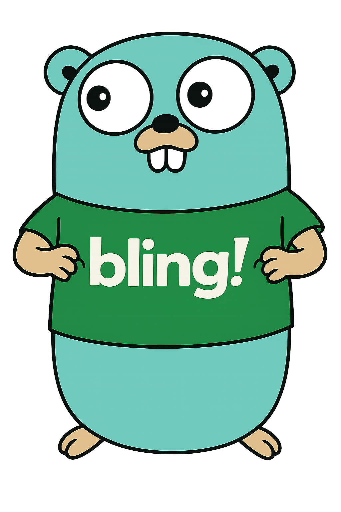

# Go + Bling API v3 – Demonstração de Integração (Conta a Receber + Boleto)



> ⚠️ **IMPORTANTE:**  
> Este repositório é **apenas uma demonstração técnica** de integração com a **API v3 do Bling** usando Go.  
> Não foi projetado nem revisado para uso em produção. Não contempla:
> - tratamentos completos de erro
> - segurança avançada
> - fluxo de autenticação automatizado
> - regras de negócio reais de cobrança

Qualquer uso em ambiente real deve passar por revisão técnica, de segurança e de negócio, seguindo as melhores práticas e a documentação oficial do Bling.

- Buscar **contatos**, **formas de pagamento** e **categorias de receitas**
- Criar uma **conta a receber** (base para boleto)
- Fazer **download do PDF** do boleto gerado

Tudo usando **OAuth2 (Bearer token)** da API v3

---

## 🚀 O que esse projeto faz

Fluxo completo:

1. Lê o **access token** da API v3 do Bling (`BLING_TOKEN`)
2. Consulta:
   - `GET /contatos`
   - `GET /formas-pagamentos`
   - `GET /categorias/receitas`
3. Cria uma **conta a receber**:
   - `POST /contas/receber`
4. Pega o **ID** da conta criada
5. Espera alguns segundos (processamento do boleto)
6. Faz o download do **PDF do boleto**:
   - `GET /contas/receber/{id}/pdf`
7. Salva o arquivo localmente como `boleto_<ID>.pdf`

É um exemplo completo de **cliente ERP em Go** com:

- Consumo de API REST v3
- Bearer token
- Estrutura de serviço (`BlingService`)
- Tratamento de erro, timeouts e validação de PDF.

---

## 🧱 Estrutura básica do código

Tudo está em um arquivo único `main.go` (modelo didático), com:

- `type BlingService`
  - guarda `BaseURL`, `AccessToken` e `*http.Client`
  - métodos:
    - `CreateContaReceber(conta ContaReceber)`
    - `GetContatos()`
    - `GetFormasPagamento()`
    - `GetCategorias()`
    - `DownloadBoletoPDF(contaID int)`

- `type ContaReceber`
  - representa os campos necessários para criar uma conta a receber

- `type Contato`, `type Categoria`, `type FormaPagamento`
  - usados como subestruturas dentro de `ContaReceber`

No `main()` o fluxo é:

1. Instancia o service com o token
2. Lista alguns contatos, formas de pagamento, categorias (para debug)
3. Monta uma `ContaReceber` com:
   - `DataEmissao`
   - `Vencimento`
   - `Valor`
   - `Historico`
   - `NroDocumento`
   - `Contato{ID: ...}`
   - `Categoria{ID: ...}`
   - `FormaPagamento{ID: ...}`
4. Chama `CreateContaReceber`
5. Extrai o `ID` retornado
6. Chama `DownloadBoletoPDF(ID)` com delay + retry
7. Salva o PDF em disco

---

## ✅ Pré-requisitos

- Go **1.20+** (recomendado)
- Conta no **Bling** com acesso à **API v3**
- Um **Aplicativo** criado no painel do Bling (OAuth2)
- Um **access token** v3 válido (tipo *Bearer*)

---

## 🔐 Configurando o token da API v3 (visão geral)

1. No Bling, crie um **Aplicativo** (privado é o ideal para uso interno)
2. Anote:
   - `client_id`
   - `client_secret`
   - `redirect_uri` configurada
3. Rode o fluxo OAuth 2.0 (authorization code):
   - Acesse a URL de autorização com:
     - `response_type=code`
     - `client_id`
     - `redirect_uri`
   - Autorize o aplicativo
   - Copie o `code` da URL de retorno
   - Troque o `code` por `access_token` no endpoint `/oauth/token`
4. Guarde o `access_token` gerado

No projeto, você **não** deixa o token hardcoded: use variável de ambiente.

---

## ⚙️ Configuração do projeto

Clone o repositório:

```bash
git clone https://github.com/fabyo/go-bling-boleto.git
cd go-bling-boleto
```

Configure o token (PowerShell / Windows):

```powershell
$env:BLING_TOKEN = "SEU_ACCESS_TOKEN_AQUI"
```

Ou em Linux/macOS:

```bash
export BLING_TOKEN="SEU_ACCESS_TOKEN_AQUI"
```

---

## ▶️ Como rodar

### Rodar direto com `go run`:

```bash
go run main.go
```

O que o programa faz:

1. Lê `BLING_TOKEN`
2. Lista:
   - primeiros contatos (`GET /contatos`)
   - primeiras formas de pagamento (`GET /formas-pagamentos`)
   - primeiras categorias de receitas (`GET /categorias/receitas`)
3. Cria uma **conta a receber** com dados de exemplo (IDs que você deve ajustar para os seus):
4. Tenta baixar o **PDF** do boleto 2 vezes:
   - espera 5 segundos
   - tenta baixar
   - se falhar, espera mais 5 segundos e tenta de novo
5. Salva o arquivo:

```text
boleto_<ID>.pdf
```

no diretório atual.

---

## 🧩 Ajustando para o seu ambiente

No código, na parte que monta a `ContaReceber`:

```go
conta := ContaReceber{
    DataEmissao:    time.Now().Format("2006-01-02"),
    Vencimento:     time.Now().AddDate(0, 1, 0).Format("2006-01-02"),
    Valor:          150.50,
    Historico:      "Teste de boleto via API Go",
    NroDocumento:   fmt.Sprintf("GO-%d", time.Now().Unix()),
    NumeroParcela:  1,
    TotalParcelas:  1,
    Contato: Contato{
        ID:   0000000000,
        Nome: "Fabyo Guimaraes",
    },
    Categoria: Categoria{
        ID: 12345678,
    },
    FormaPagamento: FormaPagamento{
        ID: 1234530,
    },
}
```
- Documentação: https://developer.bling.com.br/home

Você deve:

- Ajustar os **IDs** usando as respostas de:
  - `GetContatos()`
  - `GetFormasPagamento()`
  - `GetCategorias()`
- Ajustar `Historico`, `Valor`, datas etc. conforme o cenário.

---

## ⚠️ Cuidados importantes

- **NUNCA** commite seu `access_token` no Git
- Use sempre `BLING_TOKEN` via variável de ambiente
- IDs de contato/categoria/forma de pagamento do exemplo são **seus**, não vão existir em outra conta
  - para alguém usar esse projeto, terá que trocar esses IDs pelos próprios

---

##  Sobre o Bling

A **Bling** é uma plataforma de gestão e ERP extremamente robusta e moderna, com:

- API REST bem estruturada e seguro
- Ecossistema de integrações com e-commerce, marketplaces e logística
- Módulos de **financeiro**, **NFe/NFC-e**, **estoque**, **vendas** e muito mais

Este script em Go demonstra **menos de 1%** do que a API e o produto Bling realmente oferecem.  
Aqui foi explorado só um recorte bem específico do módulo financeiro (contas a receber + boleto) com foco educacional, para mostrar:

- organização de chamadas HTTP em Go
- uso de Bearer token
- consumo de endpoints REST na prática

Toda a inteligência de negócio, robustez, regras fiscais e recursos avançados estão no lado do **Bling**, que é claramente uma solução de ERP completa e muito bem pensada para quem precisa escalar gestão e automação.


